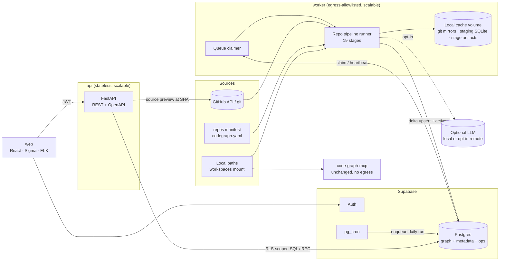

# 01 — Target Architecture

The goal is to turn CodeGraph into a repository-intelligence platform: GitHub repositories
go in, a versioned multi-layer graph is stored in Supabase, and an interactive explorer
reads the latest **activated** snapshot.

Companion docs: [00-current-state](00-current-state.md) · [02-data-model](02-data-model.md)
· [03-implementation-plan](03-implementation-plan.md)

---

## 1. Architectural decisions

| # | Decision | Rationale | Rejected alternative |
|---|---|---|---|
| D1 | **Postgres (Supabase) relational graph** with typed columns and a small JSONB `properties` bag | 20k nodes and a few hundred thousand edges are well within Postgres range. Recursive CTEs cover multi-hop. One store gives FTS, pgvector, RLS, and auth. | Neo4j/Neptune: a second system of record, no RLS, not justified at this scale |
| D2 | **Per-repository snapshots with row-version intervals** (`valid_from_seq`, `valid_to_seq`) plus an atomic `repositories.active_seq` pointer | Only changed rows are written. Activation is a single-row update. Readers never see a pending snapshot. History, diff, and rollback come for free. | Full copy per snapshot (≈7M rows/yr of duplication); in-place overwrite (inconsistent reads, no history) |
| D3 | **Deterministic UUIDv5 keys** for nodes and edges, derived from provider IDs and canonical paths | Idempotent upserts, stable URLs and bookmarks, and user overrides that survive re-ingestion | Autoincrement IDs (today): unstable |
| D4 | **Existing tree-sitter indexer reused through an adapter** writing to a per-repo staging SQLite | Keeps the proven memory discipline and hash-incremental parsing. Zero risk to MCP. | Rewriting extraction directly against Postgres |
| D5 | **Postgres-backed work queue** (`FOR UPDATE SKIP LOCKED`) plus a scheduler abstraction (pg_cron in prod, APScheduler locally) | No extra infrastructure. Workers scale horizontally. Unique partial indexes block concurrent runs per repo. | Airflow/Temporal: heavy for a 19-stage linear DAG |
| D6 | **FastAPI backend** between the UI and the database; the UI never queries tables directly | Required by the brief ("no unrestricted DB access"). Shares Pydantic models with the pipeline. Queries run under the caller's JWT so RLS still applies. | Browser → Supabase PostgREST |
| D7 | **React + TypeScript + Vite; Sigma.js (WebGL) + graphology; ELK.js in a Web Worker** | Sigma renders 10k+ elements smoothly. ELK provides layered and partitioned (region) layouts. Workers keep the main thread free. | Cytoscape.js (slower at scale); d3 canvas (today, no layered layouts) |
| D8 | **Detectors are data-driven**: YAML signature catalogs for technologies and external systems | New SDKs and providers are a catalog edit, not code. Evidence and confidence come from the rule type. | Hard-coded if-chains |
| D9 | **Deterministic first, inference later** | Semantic similarity and LLM summaries (Phase 8) only consume the validated deterministic graph | — |
| D10 | **Source text is never stored.** Previews are fetched on demand at the snapshot SHA; README/doc bodies are stored only after redaction | Minimizes the blast radius of a DB leak | Storing file blobs |
| D11 | **User metadata lives in separate tables keyed by stable node or edge keys**; the pipeline never writes them | Satisfies "manual classifications survive daily ingestion" by construction | Flags on pipeline rows |

---

## 2. System context



### Deployables

| Unit | Responsibility | Scales by | Egress |
|---|---|---|---|
| `worker` | Claims repository runs and executes the pipeline stages | Replicas (queue-based) | GitHub, Supabase, opt-in LLM |
| `api` | REST API for the UI; auth; source preview proxy; manual ingestion enqueue | Replicas (stateless) | Supabase, GitHub (preview) |
| `web` | Static SPA | CDN or served by `api` | — |
| Supabase | System of record, auth, pg_cron, optional Realtime | Managed | — |
| `code-graph-mcp` | Existing local MCP service | Unchanged | **None** |

---

## 3. Code organization

```
src/code_graph/                    # EXISTING analysis core + MCP (behaviour preserved)
  extractors/                      # + markdown.py, dockerfile.py, terraform.py, gha.py, openapi.py, k8s in yaml.py
  models.py                        # + Fact dataclass, FileResult.facts (default [])
  indexer.py                       # + injectable WalkRules, body_hash, facts table
  platform/                        # NEW, installed via extra `.[platform]`
    settings.py                    # pydantic-settings; all secrets from env / secret store
    identity.py                    # UUIDv5 key builders + normalization
    sources/      base.py github.py local.py manifest.py
    snapshot/     git_mirror.py workspace.py
    analysis/     staging.py (Indexer adapter) facts.py
    detectors/    base.py technologies.py boundaries.py integrations.py infra.py docs.py
                  catalog/{technologies,integrations,layers}.yaml
    classify/     layers.py categories.py lifecycle.py applications.py
    graph/        canonical.py builder.py validate.py diff.py rollups.py
    store/        base.py (GraphStore protocol) postgres.py memory.py
    pipeline/     stage.py runner.py run.py queue.py stages/NN_<name>.py
    describe/     base.py docstring.py local_llm.py remote_llm.py cache.py
    security/     redact.py patterns.py
    scheduler/    base.py local.py
    observability/ logging.py metrics.py
    cli.py                         # `codegraph …`
  api/                             # NEW, extra `.[api]`
    app.py deps.py schemas.py routers/{repositories,graph,nodes,functions,classifications,ingestion,snapshots}.py
supabase/
  config.toml  migrations/NNNN_*.sql  seed.sql  tests/*.sql (pgTAP)
web/                               # NEW Vite + React + TS
deploy/
  worker.Dockerfile api.Dockerfile web.Dockerfile compose.platform.yml
tests/
  (existing)  platform/  api/  db/  fixtures/orgs/…
```

---

## 4. Pipeline

### 4.1 Execution model

```
ingestion_run (trigger: schedule | manual | api | webhook | cli)
  └─ ingestion_repository_run × N    ← unit of isolation, retry and concurrency lock
       └─ ingestion_stage_run × 19   ← timing, metrics, artifacts, errors
```

- **Isolation:** each repository run is claimed independently (`SKIP LOCKED`). A failure
  marks only that repository run as `failed`, and its previous active snapshot stays live.
- **Concurrency:** a unique partial index on `ingestion_repository_runs(repository_id) WHERE
  status IN ('queued','running')` plus `pg_advisory_xact_lock(repo)` around activation.
- **Heartbeats:** workers update `heartbeat_at`. A reaper requeues runs whose heartbeat is
  older than 10 min, up to `max_attempts`.
- **Stage-level retry:** stages 1–13 persist artifacts to the cache keyed by
  `(repo_key, commit_sha, stage, stage_version)`. A retry resumes after the last completed
  stage. Stages 14–17 are idempotent through deterministic keys and cleanup of pending rows.
- **Correlation:** `run_id` and `repo_run_id` are bound into every structured log line.

### 4.2 Stage contract

```python
class Stage(Protocol):
    name: str
    version: str                    # bump ⇒ cache invalidation for this stage
    def run(self, ctx: StageContext) -> StageResult: ...

@dataclass
class StageResult:
    status: Literal["ok", "skipped", "failed"]
    outputs: dict[str, ArtifactRef]  # consumed by later stages
    metrics: dict[str, int | float]
    errors: list[StageError]         # non-fatal, recorded to ingestion_errors
```

A stage raises only for **repository-fatal** conditions. Per-file problems become
`errors` (the existing "skip the file, never abort" rule).

### 4.3 Stages

| # | Stage | Input | Output | Failure handling |
|---|---|---|---|---|
| 1 | Discovery | Sources config (repos, orgs, manifest, local paths), include/exclude rules | `RepoRef[]` (provider, provider_repo_id, full_name); upsert `organizations`, `repositories` identity | Per-source isolation; repos missing for 2 consecutive runs are marked `removed` (retention policy decides deactivation) |
| 2 | Metadata | `RepoRef` | GitHub metadata, languages, topics, license, pushed_at, CODEOWNERS; ETag cache | Rate limit → backoff/requeue; 404/403 → `access_lost` status |
| 3 | Snapshot acquisition | Tracked ref (branch/SHA), `last_analyzed_sha` | `commit_sha`, worktree path, `changed_paths` via `git diff --name-status -M` | **Skip rest** if SHA and analyzer version are unchanged and not forced (`unchanged`). Fetch failure → retry. |
| 4 | File inventory | Worktree, walk rules | `inventory` (path, size, sha256, spec, is_generated, is_vendored) + added/modified/deleted sets | Oversized/binary files → skipped with a reason |
| 5 | Language & framework detection | Inventory, manifests | `technologies[]` with evidence (e.g. `fastapi` via `pyproject.toml` dep) | Catalog miss ≠ error |
| 6 | AST analysis | Changed files, staging DB | Staging DB updated via existing `Indexer.reindex` | Parse errors are per file |
| 7 | Symbols & functions | Staging DB, facts | Signature, params, return type, docstring, decorators, exports, `body_hash`, complexity | — |
| 8 | Dependencies & imports | Staging DB, manifests, lockfiles | Resolved imports (existing resolver), package deps (purl), repo↔repo candidates | Unresolved kept honestly |
| 9 | Boundary detection | Inventory, manifests, compose/k8s/Dockerfiles | `Package`, `Workspace`, `Service`, `MonorepoComponent` candidates with member paths | — |
| 10 | External connectivity | Facts (URLs, env refs, imports), manifests, infra | `IntegrationFinding(system, kind, method, evidence[], confidence)` | Redaction before output |
| 11 | Documentation | Markdown, OpenAPI, ADRs | Doc nodes, heading outline, links, redacted README body, OpenAPI endpoints | — |
| 12 | Semantic classification | Stages 5–11 | Layer labels, repo category suggestions, lifecycle status, application suggestions | Suggestions only; user state never modified |
| 13 | Embeddings (optional) | README, descriptions, symbol names | Vectors cached by `source_hash` | Disabled by default; failures are non-fatal |
| 14 | Graph generation | All of the above | Canonical `CNode[]`, `CEdge[]` with keys, `semantic_hash`, `row_hash`, provenance | Builder errors are fatal for the repo |
| 15 | Validation | Canonical graph, previous active keys | `ValidationReport` (see §7) | **Error-level finding ⇒ stop; snapshot `failed`** |
| 16 | Supabase upsert | Canonical graph, active rows (key → row_hash) | Pending version rows at `seq = N`; old rows closed with `valid_to_seq = N` | Transaction per batch; on failure delete pending rows at seq N and reopen closed rows |
| 17 | Snapshot activation | Snapshot N (validated) | `repositories.active_seq = N` in one transaction; `graph_snapshot_activations` row | Advisory lock; post-activation invariant check |
| 18 | Cache/search refresh | Activated repos | Rollup edges (repo/app/org), centrality, `graph_changes` summary, `pg_notify('snapshot_activated')` | Failure does not un-activate; flagged `stale_rollups` and retried |
| 19 | Metrics & audit | Stage results | `ingestion_*_runs` totals, audit log | Best-effort |

### 4.4 Incremental processing

| Change | Detection | Action |
|---|---|---|
| New commit | `commit_sha ≠ last_analyzed_sha` | Run stages 4–19 on the changed set |
| No commit | SHA equal and `analyzer_version` equal | `unchanged`; no snapshot created |
| Analyzer or catalog upgrade | `analyzer_version` differs | Forced re-analysis. Detector-only bumps re-run 5, 9–19 using cached ASTs. |
| File modified | Content hash (existing `files.hash`) | Re-extract file → resolver re-run (repo-wide SQL, cheap) → builder recomputes; only rows with changed `row_hash` are written |
| File deleted | Missing from inventory | Staging rows dropped (existing `_drop_file`); builder omits keys ⇒ closed at `valid_to_seq = N` |
| File renamed | `git diff -M` | Recorded in `graph_changes` as a rename (keys change by design) |
| Unchanged function, shifted lines | Same `semantic_hash`, different `row_hash` | New version row. The diff classifies it as `moved`, not `changed`. |
| Repo archived | Metadata | `lifecycle_status = archived`; graph retained |
| Repo deleted or access lost | 404 on 2 consecutive runs | `removed_at`; hidden from active views after `REMOVED_REPO_GRACE_DAYS` |

Caches: git mirrors (treeless partial clones), staging SQLite per repo, stage artifacts,
`analysis_cache` in Postgres (descriptions, embeddings, metadata ETags), all keyed by
content or source hash.

---

## 5. Snapshot model

Every graph row carries `repository_id`, `valid_from_seq`, and a nullable `valid_to_seq`.
For repository *R* with `active_seq = A`, a row is **active** iff
`valid_from_seq ≤ A AND (valid_to_seq IS NULL OR valid_to_seq > A)`.

```
seq:            1          2 (active)        3 (pending)
fn a  v1  [1 ────────── ∞)                                     unchanged, visible
fn b  v1  [1 ──────────────────────── 3)                       closed by pending 3, still visible
fn b  v2                              [3 ── ∞)                 invisible until activation
fn c  v1             [2 ───────────── 3)                       deleted in 3, still visible
```

- **Activation** is `UPDATE repositories SET active_seq = 3`, atomic.
- **Rollback of a failed pending snapshot:** `DELETE … WHERE valid_from_seq = 3` and
  `UPDATE … SET valid_to_seq = NULL WHERE valid_to_seq = 3`.
- **Diff between seq X and Y:** rows with `valid_from_seq ∈ (X, Y]` (added or new versions)
  against rows with `valid_to_seq ∈ (X, Y]` (removed or old versions), joined on key.
- **Global graph "as of" time T:** `graph_snapshot_activations` gives each repository's
  active seq at T.
- **Retention:** prune rows with `valid_to_seq ≤ active_seq − RETAIN_SNAPSHOTS` (default 30).
- **Global entities** (ExternalService, ThirdPartyPackage, Technology, …) are
  `repository_id IS NULL`, upserted in place, and are *visible* only when an active edge
  references them.
- **User entities** (Applications, Use cases, custom relationships) are
  `origin = 'user'`, unversioned, and never touched by the pipeline.

---

## 6. Identity scheme

`key = uuid5(CODEGRAPH_NS, canonical_string)`

| Entity | Canonical string |
|---|---|
| Organization | `org:{provider}:{provider_org_id}` |
| Repository | `repo:{provider}:{provider_repo_id}` (local provider: `repo:local:{sha1(abs realpath)}`) |
| Directory / File | `path:{repo_key}:{posix_path}` |
| Code symbol | `sym:{repo_key}:{node_type}:{qualified_name}` + `#{n}` ordinal for duplicates (ordered by file path, then start line) |
| Service / Package / Component | `svc:{repo_key}:{source_file}:{name}` · `pkg:{repo_key}:{manifest_path}` |
| API route | `route:{repo_key}:{METHOD}:{normalized_path}` |
| Third-party package | `purl:pkg:{ecosystem}/{namespace}/{name}` (version is an edge property) |
| External system | `ext:{catalog_id}` or `ext:host:{registrable_domain}` |
| Technology | `tech:{catalog_id}` |
| Edge | `edge:{type}:{src_key}:{dst_key or 'raw:'+dst_raw}:{qualifier}` |
| User-created entities | Random UUIDv4 (not derived) |

Renaming a GitHub repository keeps its key. Renaming a file changes symbol keys; this is
recorded as a rename in the diff.

---

## 7. Validation (stage 15)

| Check | Severity |
|---|---|
| Every `node_type` and `edge_type` exists in the registry | error |
| Node keys unique within the snapshot | error |
| Edge endpoints exist in the snapshot, the active graph of another repo, or the global entity set; otherwise `dst_key NULL` with `dst_raw` | error |
| Self-edges only for types flagged `allow_self` (e.g. recursive CALLS) | error |
| Duplicate edge keys | error |
| `file_path`, `start_line ≤ end_line ≤ file line count` for located nodes | error |
| **Cross-repo contamination:** every repo-scoped node's path is inside the repo worktree, and no inventory file lies inside another tracked repository's root | error |
| Secret scan over all persisted text fields (names, signatures, docstrings, properties, evidence, README) | error |
| Inferred rows (`origin = 'inferred'`) have provenance and `0 < confidence < 1` | error |
| Node/edge counts within `[0.5×, 2×]` of the previous snapshot (configurable) or absolute caps | warning, or error above caps |
| Resolution rate drop > 20 points versus the previous snapshot | warning |

The report is stored in `repository_snapshots.validation_report` and shown in the pipeline UI.

---

## 8. Read path & performance

| Concern | Approach |
|---|---|
| Never load 20k nodes | Every graph endpoint takes `view`, `focus`, `depth`, `filters`, `limit` (default 500, hard cap 2,000) and returns `truncated` plus aggregate nodes for collapsed groups |
| Overview levels | `graph_rollup_edges` precomputed at activation: repo→repo, app→app, org→org, service→external with weights |
| Neighborhood | SQL function `graph_neighborhood(key, depth, edge_types[], direction, limit)`: recursive CTE over active edges with a visited array and node cap |
| Search | Generated `tsvector` (name, qname, path, description) + `pg_trgm` for fuzzy + optional pgvector |
| Filter counts | `POST /graph/subgraph:count` runs the same predicates with `count(*)` only |
| Caching | API: ETag = hash(active seqs of involved repos + query) → 304; in-process LRU |
| Front end | Sigma WebGL; ELK and ForceAtlas2 in Web Workers; virtualized lists (TanStack Virtual); debounced search (250 ms); incremental graphology merges on expand |
| Layout persistence | `graph_layout_preferences(view_hash, user_id, positions)`; deterministic layouts need no persistence |

Views and default depth: Organization 1–2 · Application 2–3 · Repository 2–4 ·
Function = call neighborhood (depth 1, expandable) · External systems = service/repo ↔ external.

---

## 9. Security

| Area | Control |
|---|---|
| GitHub auth | GitHub App installation tokens (preferred) or fine-grained PAT from env/secret manager; never logged; redacted from errors |
| Secrets in code | `security/redact.py`: provider token patterns (GitHub, AWS, GCP, Slack, Stripe, JWT, PEM keys), connection-string passwords, high-entropy assignments. Applied at extraction boundaries **and** re-checked in validation. `.env*` files contribute **key names only**. |
| URLs | Userinfo and query strings stripped; only scheme + host + path template kept |
| Source code | Not stored. `GET /nodes/:id/source` fetches from GitHub at snapshot SHA with the caller's access checked, redacts, and returns plain text rendered by Shiki (no HTML injection) |
| Markdown | `react-markdown` + `rehype-sanitize`; raw HTML disabled; links `rel="noopener noreferrer"`; images proxied or blocked |
| DB access | UI → API only. API sets `request.jwt.claims` and `role authenticated` per transaction so **RLS is enforced in Postgres**. Worker uses a dedicated `pipeline_writer` role without access to user tables. |
| Private repos | `repository_access(repository_id, principal, role)` drives RLS; access synced from GitHub collaborators/teams in stage 2 |
| LLM | `DESCRIBE_PROVIDER=none` by default. Remote providers require `ALLOW_REMOTE_AI=true` **and** a per-repo or per-org opt-in; private repos are denied unless explicitly allowed. Every call is audit-logged. |
| Egress | MCP container: none. Worker/API: allowlist enforced in compose/k8s network policy. |
| Audit | `audit_log` for ingestion triggers, overrides, confirmations, and access changes |

---

## 10. Observability

- Structured JSON logs (`structlog`) with `run_id`, `repo_run_id`, `stage`, `repository`.
- Stage metrics persisted: duration, files processed/skipped, nodes and edges
  created/updated/deleted, parse/classification/detection/DB errors, validation outcome.
- API latency and graph-query latency via middleware, stored as rolling aggregates in
  `api_metrics_minutely`, with optional OpenTelemetry export.
- UI render timing (`performance.measure`) posted to `/telemetry/ui` (sampled, anonymous).
- `GET /ingestion/health`: last run status, repos failing N times, stale rollups, queue depth, oldest heartbeat.

---

## 11. Deployment topology

| Environment | Setup |
|---|---|
| Local dev (WSL) | `supabase start` (local Postgres + Auth) · `docker compose -f deploy/compose.platform.yml up worker api` · `pnpm -C web dev` · existing `code-graph-mcp` unchanged |
| Production | Hosted Supabase project; `worker` and `api` containers on any container host (Fly/ECS/k8s); `web` on CDN; pg_cron enqueues the daily run at `INGEST_CRON` in `INGEST_TZ` |
| Migrations | `supabase/migrations` applied via `supabase db push` in CI; every migration ships a tested down script in `supabase/rollback/` |
| Backups | Supabase PITR; graph is re-derivable from GitHub, but **user tables are not** and are additionally exported nightly (`codegraph export-user-metadata`) |

---

## 12. Assumptions (defaults until decided otherwise)

1. Hosted Supabase for production, local Supabase CLI for development.
2. GitHub App auth. PAT supported for single-user setups.
3. Single tenant (one organization of users). RLS is designed for private-repo scoping, not multi-tenancy.
4. React + Sigma.js + ELK.js front end.
5. Remote LLM summaries disabled. When enabled, Claude via the Anthropic API behind the `describe/` interface.
6. 30 snapshots of history retained per repository.
7. Daily run at 02:00 in the configured timezone (default `UTC`).
