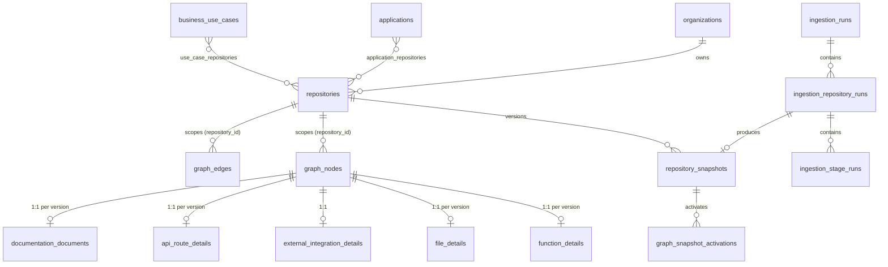

# 02 — Graph Data Model & Supabase Schema

The model is registry-driven. Node and edge types are **rows**, not enums, so adding a
type means one seed row plus an extractor or detector, with no UI rewrite. The UI reads
`node_types` for shape, icon, category, and detail level.

---

## 1. Type registries

### 1.1 `node_types`

Columns: `type`, `category`, `display_name`, `shape`, `icon`, `detail_level`
(0 = org … 5 = symbol), `is_external`, `phase` (when first produced).

| Category | Types (detail level) | Produced by (phase) |
|---|---|---|
| organizational | Organization (0), Team (0), RepositoryOwner (0), BusinessUnit (0) | GitHub metadata, CODEOWNERS, user (2, 4) |
| application | Product (0), Application (1), CaseStudy (1), BusinessUseCase (1), Domain (1), Capability (1), Repository (2), Service (2), Package (2), Module (3), Workspace (2), MonorepoComponent (2) | Discovery, boundaries, user (2, 4) |
| source | Directory (3), SourceFile (3), ConfigurationFile (3), Class (4), Interface (4), Struct (4), Enum (4), Type (4), Function (5), Method (5), Variable (5), Constant (5), ApiRoute (4), EventHandler (4), BackgroundJob (4), CliCommand (4), TestSuite (4), TestCase (5) | Analysis (2, 3) |
| infrastructure | Dockerfile (3), DockerImage (2), KubernetesDeployment (2), KubernetesService (2), HelmChart (2), TerraformModule (2), TerraformResource (3), CloudResource (2), CiWorkflow (2), Environment (1), SecretReference (4), InfrastructureConfig (3) | Infra detectors (5) |
| documentation | Readme (3), DocumentationPage (3), MarkdownDocument (3), ArchitectureDocument (3), ApiSpecification (3), OpenApiEndpoint (4), Adr (3), Changelog (3), Tutorial (3), Example (3), DiagramReference (4) | Docs extractor (3) |
| external | ExternalApi, ExternalService, Database, DataWarehouse, ObjectStorage, MessageBroker, Queue, Topic, Cache, SearchEngine, IdentityProvider, SaasProvider, CloudService, PaymentProvider, MonitoringSystem, NotificationProvider, ThirdPartyPackage, ContainerRegistry, ExternalRepository (all level 2, `is_external = true`) | Integration detectors (5) |
| semantic | Technology, Framework, ProgrammingLanguage, RepositoryCategory, ArchitecturalLayer, DeploymentEnvironment, RiskFinding (level 1) | Classifiers (4, 8) |

### 1.2 Mapping from the current SQLite model

| Current | New |
|---|---|
| `File` (code) | `SourceFile` |
| `Config` | `ConfigurationFile` (a more specific type when a detector recognizes it: `Dockerfile`, `CiWorkflow`, …) |
| `Class` · `Function` · `Method` · `Interface` | Same names |
| `Service` (compose) | `Service` with `properties.source = 'compose'` |
| `CONTAINS` file→symbol, class→method | `DEFINES` |
| `CONTAINS` (directory/file) | `CONTAINS` (new Directory nodes) |
| `IMPORTS` · `CALLS` · `IMPLEMENTS` | Same |
| `INHERITS` | `EXTENDS` |
| `USES_TYPE` | `REFERENCES` with `properties.ref_kind = 'type'` |

### 1.3 `edge_types`

Columns: `type`, `category`, `display_name`, `allow_self`, `inferable`.

| Category | Types |
|---|---|
| organizational | OWNS, MAINTAINS, BELONGS_TO, OWNED_BY |
| application | PART_OF, IMPLEMENTS_USE_CASE, SUPPORTS, IS_A_CASE_STUDY_FOR, RELATED_TO, CONTAINS |
| source | DEFINES, CALLS (`allow_self`), REFERENCES, IMPORTS, EXTENDS, IMPLEMENTS, OVERRIDES, TESTS, READS, WRITES, EMITS, HANDLES, EXPORTS |
| infrastructure | DEFINES_INFRASTRUCTURE, DEPLOYS, RUNS_ON, BUILDS, BUILT_FROM, EXPOSES, CONNECTS_TO, PUBLISHES_TO, CONSUMES_FROM, USES, PUSHES_TO |
| documentation | DOCUMENTED_BY, DESCRIBES, DOC_REFERENCES, RELATES_TO |
| semantic (inferable) | CLASSIFIED_AS, USES_TECHNOLOGY, IMPLEMENTS_CAPABILITY, SIMILAR_TO, POSSIBLY_DUPLICATES, DEPENDS_ON, SEMANTICALLY_RELATED_TO, GROUPED_WITH, FORKED_FROM, IN_LAYER |

Relationships the brief names with the same verb for different endpoint pairs (for example
`Repository IMPLEMENTS UseCase` against `Class IMPLEMENTS Interface`) get distinct types
so type-based filtering stays unambiguous. `edge_type_endpoints(edge_type, src_type,
dst_type)` records the allowed pairs, and validation enforces them.

---

## 2. Common row semantics

Every graph row (node or edge) has:

| Column | Meaning |
|---|---|
| `key uuid` | Stable identity (see `01` §6) |
| `repository_id` | Owning repository snapshot stream; `NULL` = global or user entity |
| `valid_from_seq`, `valid_to_seq` | Snapshot validity interval (see `01` §5) |
| `origin` | `extracted` (static fact) · `declared` (manifest/metadata/explicit config) · `inferred` (heuristic/semantic) · `user` |
| `confidence real` | 1.0 for extracted/declared/user; `(0,1)` for inferred |
| `provenance jsonb` | `{"detector": "integrations.env_var", "version": "1.2", "rule": "stripe.env", "evidence": [{"file": "app/pay.py", "line": 12, "kind": "env_ref", "value": "STRIPE_API_KEY"}]}`. Values are redacted. |
| `semantic_hash` / `row_hash` | Change detection (meaning vs. any displayed field) |
| `created_at` | Row version creation time |

User overrides never modify these rows. They live in the user tables (§4.6) and are
merged by the `effective_*` views.

---

## 3. Entity-relationship overview



---

## 4. Schema (migration sketches)

This is illustrative DDL for review. The real migrations are split per phase (see `03`).

### 4.1 Extensions and registries — `0001_extensions_registries.sql`

```sql
create extension if not exists pgcrypto;
create extension if not exists pg_trgm;
create extension if not exists vector;          -- used only when embeddings are enabled

create table node_types (
  type          text primary key,
  category      text not null check (category in
                ('organizational','application','source','infrastructure',
                 'documentation','external','semantic')),
  display_name  text not null,
  shape         text not null,
  icon          text not null,
  detail_level  smallint not null check (detail_level between 0 and 5),
  is_external   boolean not null default false
);

create table edge_types (
  type          text primary key,
  category      text not null,
  display_name  text not null,
  allow_self    boolean not null default false,
  inferable     boolean not null default false
);

create table edge_type_endpoints (
  edge_type text references edge_types, src_type text references node_types,
  dst_type  text references node_types, primary key (edge_type, src_type, dst_type)
);
```

### 4.2 Identity and metadata — `0002_identity.sql`

```sql
create table organizations (
  id               uuid primary key default gen_random_uuid(),
  node_key         uuid not null unique,
  provider         text not null,
  provider_org_id  bigint not null,
  login            text not null,
  name             text, url text, avatar_url text,
  created_at       timestamptz not null default now(),
  updated_at       timestamptz not null default now(),
  unique (provider, provider_org_id)
);

create table repositories (
  id                    uuid primary key default gen_random_uuid(),
  node_key              uuid not null unique,
  provider              text not null default 'github',
  provider_repo_id      bigint not null,
  organization_id       uuid references organizations,
  full_name             text not null,
  name                  text not null,
  url                   text not null,
  default_branch        text,
  tracked_ref           text,                  -- branch or pinned SHA override
  description           text,
  primary_language      text,
  languages             jsonb not null default '{}',  -- {"Python": 12345}
  topics                text[] not null default '{}',
  visibility            text check (visibility in ('public','private','internal')),
  is_archived           boolean not null default false,
  is_fork               boolean not null default false,
  fork_parent_full_name text,
  stars int, forks int, watchers int, open_issues int, size_kb int,
  license_spdx          text,
  gh_created_at timestamptz, gh_updated_at timestamptz, gh_pushed_at timestamptz,
  last_commit_at        timestamptz,
  lifecycle_status      text not null default 'new' check (lifecycle_status in
    ('new','active','recently_updated','stale','archived','deprecated','abandoned','removed')),
  ingestion_status      text not null default 'pending' check (ingestion_status in
    ('pending','running','succeeded','failed','partial','unchanged','access_lost')),
  active_snapshot_id    uuid,                  -- FK added after repository_snapshots
  active_seq            int not null default 0,
  last_analyzed_sha     text,
  last_successful_ingestion_at timestamptz,
  removed_at            timestamptz,
  created_at timestamptz not null default now(),
  updated_at timestamptz not null default now(),
  unique (provider, provider_repo_id)
);
create index on repositories (organization_id);
create index on repositories (lifecycle_status);
create index repositories_search on repositories using gin (full_name gin_trgm_ops);

create table repository_members (   -- maintainers/contributors (only where permitted)
  repository_id uuid references repositories on delete cascade,
  login text not null, role text not null, contributions int, last_active_at timestamptz,
  source text not null, primary key (repository_id, login, role)
);

create table repository_access (    -- drives RLS for private repositories
  repository_id uuid references repositories on delete cascade,
  principal_type text check (principal_type in ('user','team','everyone')),
  principal_id text not null,
  role text not null check (role in ('read','admin')),
  primary key (repository_id, principal_type, principal_id)
);
```

### 4.3 Snapshots and graph — `0003_graph.sql`

```sql
create table repository_snapshots (
  id                 uuid primary key default gen_random_uuid(),
  repository_id      uuid not null references repositories on delete cascade,
  seq                int not null,
  commit_sha         text not null,
  commit_at          timestamptz,
  parent_snapshot_id uuid references repository_snapshots,
  analyzer_version   text not null,
  status             text not null check (status in
                     ('pending','validating','active','superseded','failed','rolled_back')),
  repository_run_id  uuid,
  stats              jsonb not null default '{}',
  validation_report  jsonb,
  created_at         timestamptz not null default now(),
  activated_at       timestamptz,
  unique (repository_id, seq)
);
create unique index one_open_snapshot_per_repo
  on repository_snapshots (repository_id) where status in ('pending','validating');

create table graph_nodes (
  id               bigint generated always as identity primary key,  -- version row id
  key              uuid not null,
  node_type        text not null references node_types,
  repository_id    uuid references repositories on delete cascade,
  valid_from_seq   int not null default 0,
  valid_to_seq     int,
  name             text not null,
  qualified_name   text,
  file_path        text,
  start_line       int, end_line int,
  language         text,
  layers           text[] not null default '{}',
  origin           text not null check (origin in ('extracted','declared','inferred','user')),
  confidence       real not null default 1.0 check (confidence > 0 and confidence <= 1),
  provenance       jsonb not null default '{}',
  description      text,
  description_source text check (description_source in
                     ('docstring','api_doc','signature','generated_local','generated_remote','user')),
  properties       jsonb not null default '{}',
  semantic_hash    text not null,
  row_hash         text not null,
  created_at       timestamptz not null default now(),
  search           tsvector generated always as (
      setweight(to_tsvector('simple', coalesce(name,'')), 'A') ||
      setweight(to_tsvector('simple', replace(coalesce(qualified_name,''), '.', ' ')), 'B') ||
      setweight(to_tsvector('simple', replace(coalesce(file_path,''), '/', ' ')), 'C') ||
      setweight(to_tsvector('english', coalesce(description,'')), 'D')) stored,
  check (valid_to_seq is null or valid_to_seq > valid_from_seq)
);
-- at most one open version per key (pending replaces active only after close)
create unique index graph_nodes_open_key on graph_nodes (key) where valid_to_seq is null;
create index graph_nodes_key            on graph_nodes (key, valid_from_seq);
create index graph_nodes_repo_from      on graph_nodes (repository_id, valid_from_seq);
create index graph_nodes_repo_to        on graph_nodes (repository_id, valid_to_seq);
create index graph_nodes_repo_type      on graph_nodes (repository_id, node_type) where valid_to_seq is null;
create index graph_nodes_repo_path      on graph_nodes (repository_id, file_path);
create index graph_nodes_search         on graph_nodes using gin (search);
create index graph_nodes_name_trgm      on graph_nodes using gin (name gin_trgm_ops);
create index graph_nodes_layers         on graph_nodes using gin (layers);

create table graph_edges (
  id               bigint generated always as identity primary key,
  key              uuid not null,
  edge_type        text not null references edge_types,
  src_key          uuid not null,
  dst_key          uuid,                -- NULL = honestly unresolved
  dst_raw          text,
  repository_id    uuid references repositories on delete cascade,
  valid_from_seq   int not null default 0,
  valid_to_seq     int,
  origin           text not null check (origin in ('extracted','declared','inferred','user')),
  confidence       real not null default 1.0,
  provenance       jsonb not null default '{}',
  properties       jsonb not null default '{}',   -- e.g. {"version": "^4.2", "line": 31}
  row_hash         text not null,
  created_at       timestamptz not null default now()
);
create unique index graph_edges_open_key on graph_edges (key) where valid_to_seq is null;
create index graph_edges_src   on graph_edges (src_key, edge_type) include (dst_key, valid_from_seq, valid_to_seq);
create index graph_edges_dst   on graph_edges (dst_key, edge_type) include (src_key, valid_from_seq, valid_to_seq);
create index graph_edges_repo_from on graph_edges (repository_id, valid_from_seq);
create index graph_edges_repo_to   on graph_edges (repository_id, valid_to_seq);

-- Active-graph views (the only surfaces the API reads for "latest")
create view active_nodes with (security_invoker = true) as
  select n.* from graph_nodes n
  left join repositories r on r.id = n.repository_id
  where (n.repository_id is null and n.valid_to_seq is null)
     or (n.valid_from_seq <= r.active_seq
         and (n.valid_to_seq is null or n.valid_to_seq > r.active_seq)
         and r.removed_at is null);

create view active_edges with (security_invoker = true) as
  select e.* from graph_edges e
  left join repositories r on r.id = e.repository_id
  where (e.repository_id is null and e.valid_to_seq is null)
     or (e.valid_from_seq <= r.active_seq
         and (e.valid_to_seq is null or e.valid_to_seq > r.active_seq)
         and r.removed_at is null);

create table graph_snapshot_activations (
  id              bigint generated always as identity primary key,
  repository_id   uuid not null references repositories,
  snapshot_id     uuid not null references repository_snapshots,
  from_seq        int not null, to_seq int not null,
  ingestion_run_id uuid,
  activated_at    timestamptz not null default now(),
  change_summary  jsonb not null default '{}'   -- counts per node/edge type: added/removed/changed/moved
);
create index on graph_snapshot_activations (activated_at desc);

create table graph_changes (        -- materialized per activation for "what changed"
  activation_id   bigint references graph_snapshot_activations on delete cascade,
  entity          text check (entity in ('node','edge')),
  key             uuid not null,
  change          text check (change in ('added','removed','changed','moved','renamed')),
  entity_type     text not null,
  name            text,
  old_row_id      bigint, new_row_id bigint,
  primary key (activation_id, entity, key)
);

create table graph_rollup_edges (   -- overview aggregates, rebuilt at activation
  level      text check (level in ('repository','application','organization','service')),
  src_key    uuid, dst_key uuid, edge_type text, weight int not null,
  sample_edge_keys uuid[] not null default '{}',
  computed_at timestamptz not null default now(),
  primary key (level, src_key, dst_key, edge_type)
);
```

### 4.4 Typed detail tables — `0004_source_details.sql`

Detail rows are 1:1 with a node **version** row (`node_row_id`), so they version
automatically and cascade with pruning.

```sql
create table file_details (
  node_row_id bigint primary key references graph_nodes on delete cascade,
  content_sha256 text not null, size_bytes int, line_count int,
  file_kind text,             -- source | config | doc | test | generated | vendored
  last_commit_sha text, last_commit_at timestamptz
);

create table function_details (
  node_row_id bigint primary key references graph_nodes on delete cascade,
  signature text, parameters jsonb not null default '[]',   -- [{"name","type","default","kind"}]
  return_type text, docstring text, decorators text[] not null default '{}',
  is_exported boolean, is_async boolean, is_test boolean,
  cyclomatic_complexity int, loc int, body_hash text not null,
  last_commit_sha text
);

create table api_route_details (
  node_row_id bigint primary key references graph_nodes on delete cascade,
  http_method text, path_template text, framework text, handler_key uuid
);

create table external_integration_details (
  node_row_id bigint primary key references graph_nodes on delete cascade,
  provider text, integration_kind text, catalog_id text, homepage text
);

create table infrastructure_details (
  node_row_id bigint primary key references graph_nodes on delete cascade,
  tool text, resource_type text, provider text, region text, environment text
);

create table documentation_documents (
  node_row_id bigint primary key references graph_nodes on delete cascade,
  doc_kind text, title text, outline jsonb not null default '[]',
  body_markdown text,                 -- stored only after redaction; capped (DOC_BODY_MAX_BYTES)
  body_sha256 text, redactions int not null default 0
);

create table node_embeddings (
  key uuid not null, model text not null, source_hash text not null,
  embedding vector(768) not null, created_at timestamptz default now(),
  primary key (key, model)
);
```

### 4.5 Classification and grouping — `0005_classification.sql`

```sql
create table applications (          -- also mirrored as Application graph nodes (key = node_key)
  id uuid primary key default gen_random_uuid(), node_key uuid unique not null,
  name text not null, description text, owner text, business_domain text,
  origin text not null check (origin in ('user','declared','inferred_confirmed')),
  created_by uuid, created_at timestamptz default now(), updated_at timestamptz default now()
);
create table products (id uuid primary key default gen_random_uuid(), node_key uuid unique not null,
  name text not null, description text);
create table business_domains (id uuid primary key default gen_random_uuid(), node_key uuid unique not null,
  name text not null, description text);
create table business_use_cases (id uuid primary key default gen_random_uuid(), node_key uuid unique not null,
  name text not null, description text, is_case_study boolean not null default false);

create table application_repositories (
  application_id uuid references applications on delete cascade,
  repository_id uuid references repositories on delete cascade,
  role text, source text not null, primary key (application_id, repository_id));
create table application_services (
  application_id uuid references applications on delete cascade,
  service_key uuid not null, source text not null, primary key (application_id, service_key));

create table taxonomies (id text primary key, name text not null, is_custom boolean not null default false,
  allows_multiple boolean not null default true);    -- category, layer, lifecycle, use_case…
create table taxonomy_terms (taxonomy_id text references taxonomies, term text,
  display_name text, parent_term text, primary key (taxonomy_id, term));

-- Unified classification ledger: every label has a source and status
create table classifications (
  id uuid primary key default gen_random_uuid(),
  subject_key uuid not null,                 -- repository/service/file/function key
  taxonomy_id text not null, term text not null,
  source text not null check (source in
     ('github_metadata','static_analysis','documentation','inference','user_override','manifest')),
  status text not null check (status in ('explicit','inferred','suggested','confirmed','rejected')),
  confidence real not null default 1.0,
  evidence jsonb not null default '[]',
  pipeline_owned boolean not null,           -- false ⇒ pipeline never updates/deletes
  decided_by uuid, decided_at timestamptz,
  created_at timestamptz default now(), updated_at timestamptz default now(),
  foreign key (taxonomy_id, term) references taxonomy_terms,
  unique (subject_key, taxonomy_id, term, source)
);
create index on classifications (taxonomy_id, term, status);

create table classification_suggestions (  -- groupings/similarity awaiting a decision
  id uuid primary key default gen_random_uuid(),
  suggestion_type text not null,            -- application_grouping | similar | duplicate | layer
  subject_keys uuid[] not null, payload jsonb not null,
  confidence real not null, evidence jsonb not null,
  status text not null default 'open' check (status in ('open','accepted','rejected','superseded')),
  fingerprint text unique not null,         -- stops re-suggesting rejected items
  created_at timestamptz default now(), decided_by uuid, decided_at timestamptz
);
```

### 4.6 User metadata — `0006_user_metadata.sql` (never written by the pipeline)

```sql
create table custom_repository_metadata (repository_id uuid primary key references repositories,
  description text, tags text[] not null default '{}', owner text, doc_links jsonb default '[]',
  updated_by uuid, updated_at timestamptz default now());
create table user_node_overrides (node_key uuid, field text, value jsonb not null,
  updated_by uuid, updated_at timestamptz default now(), primary key (node_key, field));
create table user_relationships (id uuid primary key default gen_random_uuid(), edge_type text references edge_types,
  src_key uuid not null, dst_key uuid not null, note text, created_by uuid, created_at timestamptz default now());
create table user_relationship_verdicts (edge_key uuid primary key, verdict text check (verdict in ('valid','invalid')),
  note text, decided_by uuid, decided_at timestamptz default now());
create table custom_groupings (id uuid primary key default gen_random_uuid(), name text not null,
  kind text not null, description text, created_by uuid, created_at timestamptz default now());
create table custom_grouping_members (grouping_id uuid references custom_groupings on delete cascade,
  member_key uuid, primary key (grouping_id, member_key));
create table user_annotations (id uuid primary key default gen_random_uuid(), node_key uuid not null,
  body text not null, created_by uuid, created_at timestamptz default now());
create table saved_graph_views (id uuid primary key default gen_random_uuid(), owner uuid, name text,
  state jsonb not null, is_shared boolean default false, created_at timestamptz default now());
create table graph_layout_preferences (owner uuid, view_hash text, positions jsonb not null,
  updated_at timestamptz default now(), primary key (owner, view_hash));
create table graph_bookmarks (owner uuid, node_key uuid, created_at timestamptz default now(),
  primary key (owner, node_key));
create table audit_log (id bigint generated always as identity primary key, actor text not null,
  action text not null, target jsonb, detail jsonb, correlation_id text, at timestamptz default now());
```

`effective_classifications` view precedence: `user_override` (confirmed/rejected) →
`manifest`/`explicit` → `confirmed` → `inferred` ≥ threshold → `suggested`. Rejected
labels hide their pipeline counterpart.

### 4.7 Pipeline operations — `0007_pipeline_ops.sql`

```sql
create table ingestion_runs (
  id uuid primary key default gen_random_uuid(),
  trigger text not null check (trigger in ('schedule','manual','api','webhook','cli')),
  scope jsonb not null,        -- {"all": true} | {"repository_ids": [...]} | {"orgs": [...]}
  force boolean not null default false,
  status text not null check (status in ('queued','running','succeeded','partial','failed','cancelled')),
  correlation_id text not null, requested_by text,
  created_at timestamptz default now(), started_at timestamptz, finished_at timestamptz,
  stats jsonb not null default '{}'
);

create table ingestion_repository_runs (
  id uuid primary key default gen_random_uuid(),
  run_id uuid not null references ingestion_runs on delete cascade,
  repository_id uuid not null references repositories,
  status text not null check (status in ('queued','running','succeeded','unchanged','failed','cancelled')),
  attempt int not null default 0, max_attempts int not null default 3,
  target_sha text, snapshot_id uuid references repository_snapshots,
  claimed_by text, heartbeat_at timestamptz, next_attempt_at timestamptz,
  started_at timestamptz, finished_at timestamptz,
  error_summary text, stats jsonb not null default '{}'
);
create unique index one_live_run_per_repo on ingestion_repository_runs (repository_id)
  where status in ('queued','running');
create index on ingestion_repository_runs (status, next_attempt_at);

create table ingestion_stage_runs (
  id bigint generated always as identity primary key,
  repository_run_id uuid not null references ingestion_repository_runs on delete cascade,
  stage text not null, stage_version text not null, attempt int not null,
  status text not null check (status in ('running','ok','skipped','failed')),
  started_at timestamptz not null, finished_at timestamptz, duration_ms int,
  metrics jsonb not null default '{}', artifact_ref text
);

create table ingestion_errors (
  id bigint generated always as identity primary key,
  repository_run_id uuid references ingestion_repository_runs on delete cascade,
  stage text not null, severity text not null, error_class text not null,
  file_path text, message text not null,       -- redacted
  created_at timestamptz default now()
);

create table analysis_cache (
  cache_key text primary key,                  -- sha256(kind|version|source_hash)
  kind text not null, analyzer_version text not null,
  value jsonb not null, created_at timestamptz default now(), last_hit_at timestamptz
);

-- Work queue claim (called by workers)
create function claim_repository_run(worker text) returns ingestion_repository_runs
language sql as $$
  update ingestion_repository_runs r set status = 'running', claimed_by = worker,
         heartbeat_at = now(), started_at = coalesce(started_at, now()), attempt = attempt + 1
  where r.id = (select id from ingestion_repository_runs
                where status = 'queued' and coalesce(next_attempt_at, now()) <= now()
                order by next_attempt_at nulls first
                for update skip locked limit 1)
  returning r.*;
$$;
```

### 4.8 Query functions — `0008_graph_functions.sql`

| Function | Purpose |
|---|---|
| `graph_neighborhood(p_key uuid, p_depth int, p_edge_types text[], p_direction text, p_limit int)` | Recursive CTE over `active_edges`; returns nodes and edges plus `truncated` |
| `graph_subgraph(p_view text, p_focus uuid, p_filters jsonb, p_limit int)` | View-aware selection (org/app/repo) that falls back to rollups above the detail level |
| `graph_count(p_filters jsonb)` | Counts nodes/edges for the filter drawer before loading |
| `graph_search(p_q text, p_filters jsonb, p_limit int, p_cursor text)` | tsvector rank + trigram similarity; keyset pagination |
| `graph_diff(p_repository_id uuid, p_from int, p_to int)` | Added/removed/changed/moved over validity intervals |
| `activate_snapshot(p_snapshot_id uuid)` | Advisory lock, status check, pointer update, activation row, supersede previous |
| `rollback_snapshot(p_snapshot_id uuid)` | Deletes pending rows and reopens closed rows |
| `refresh_rollups(p_repository_ids uuid[])` | Rebuilds `graph_rollup_edges` for affected keys |
| `prune_history(p_retain int)` | Retention |

### 4.9 Row-level security — `0009_rls.sql`

- RLS enabled on every table.
- `authenticated` can `select` repositories, nodes, edges, and details when
  `visibility = 'public'` **or** `exists (repository_access … matching auth.uid() / team claims)`.
  Global entities are visible when referenced by a visible active edge (enforced in the
  view/function layer).
- User tables: owners can `insert/update/delete` their own rows; shared views are readable.
- `pipeline_writer` role: DML on graph, snapshot, and ops tables; **no** grant on user tables.
- `anon`: no access.

---

## 5. Volume estimate

| Table | Initial | Daily churn | 30-snapshot retention |
|---|---|---|---|
| graph_nodes | ~20k | ~1–3 % | ≤ ~40k rows |
| graph_edges | ~150–250k (today 108k for 16k nodes) | ~1–3 % | ≤ ~400k rows |
| function_details | ~9k | small | ≤ ~20k |
| graph_changes | — | ~5k/day | prune with activations > 90 days |

This fits comfortably on a small Supabase instance. Bulk writes use `COPY` into temporary
tables, then `INSERT … SELECT` merges through a session-mode (non-transaction-pooled)
connection.
